# ARC Capstone Pipeline Flowchart

```mermaid
flowchart TD
    %% ── Data Sources ──────────────────────────────────────
    NHC["🌀 NHC<br/>Storm Intensity<br/>(hurricane category / track)"]
    NSI["🏠 NSI<br/>National Structure Inventory<br/>(building characteristics + population)"]
    SVI["📊 SVI<br/>Social Vulnerability Index<br/>(census tract level)"]

    %% ── Processing ────────────────────────────────────────
    SLOSH["SLOSH Model<br/>Storm Surge Simulation<br/>(cN_mean / cN_high per grid cell)"]
    RASTER["Flood Depth Raster<br/>(.tif, ft above ground)<br/>rasterized from SLOSH polygons"]
    NSI_CSV["Building Inventory CSV<br/>(occtype→Occ, val_struct→Cost,<br/>sqft→Area, num_story, found_type,<br/>found_ht, lat/lon)"]

    %% ── FAST ──────────────────────────────────────────────
    FAST["⚡ FAST<br/>Hazus Flood Assessment<br/>Structure Tool"]

    %% ── Outputs ───────────────────────────────────────────
    DMG["Building-Level Damage<br/>• BldgDmgPct (% damaged)<br/>• BldgLossUSD ($ loss)<br/>• Depth_in_Struc (ft)"]

    POP["Population Disrupted<br/>= Σ (building pop × damage probability)<br/>split: daytime vs nighttime / 65+ vs &lt;65"]

    VULN["High-Need Population<br/>= Disrupted pop × SVI weight<br/>(elderly, disabled, low-income)"]

    SERVICES["🔴 Red Cross<br/>Care &amp; Support Services<br/>• Shelter capacity estimate<br/>• Casework demand<br/>• ERV deployment zones"]

    %% ── Flow ──────────────────────────────────────────────
    NHC --> SLOSH
    SLOSH --> RASTER
    NSI --> NSI_CSV
    NSI --> POP

    RASTER --> FAST
    NSI_CSV --> FAST
    FAST --> DMG

    DMG --> POP
    POP --> VULN
    SVI --> VULN
    VULN --> SERVICES

    %% ── Styling ───────────────────────────────────────────
    classDef datasrc  fill:#dbeafe,stroke:#3b82f6,color:#1e3a5f
    classDef process  fill:#fef9c3,stroke:#ca8a04,color:#713f12
    classDef tool     fill:#dcfce7,stroke:#16a34a,color:#14532d
    classDef output   fill:#fce7f3,stroke:#db2777,color:#831843

    class NHC,NSI,SVI datasrc
    class SLOSH,RASTER,NSI_CSV process
    class FAST tool
    class DMG,POP,VULN,SERVICES output
```

## Data Variable Mapping

| Pipeline Stage | Data Source | Key Variables |
|---|---|---|
| Storm Surge | SLOSH Parquet | `geometry_wkt`, `cN_mean`, `cN_high`, `topography` |
| Flood Raster | Rasterized SLOSH | GeoTIFF `.tif` (ft depth) |
| Building Inventory | NSI Parquet | `occtype`, `val_struct`, `sqft`, `num_story`, `found_type`, `found_ht`, `latitude`, `longitude`, `val_cont`, `bid` |
| Population | NSI Parquet | `pop2pmo65`, `pop2pmu65`, `pop2amo65`, `pop2amu65`, `o65disable`, `u65disable` |
| Social Vulnerability | SVI (external) | SVI composite score by census tract |
| FAST Output | FAST results CSV | `BldgDmgPct`, `BldgLossUSD`, `Depth_in_Struc` |
